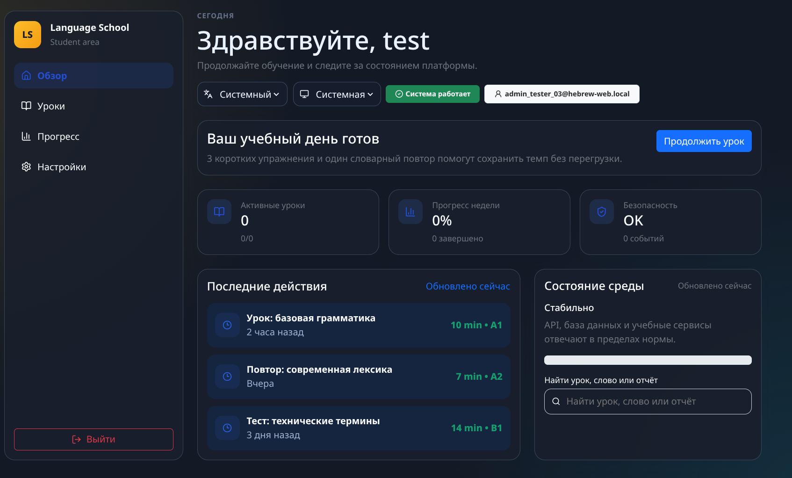
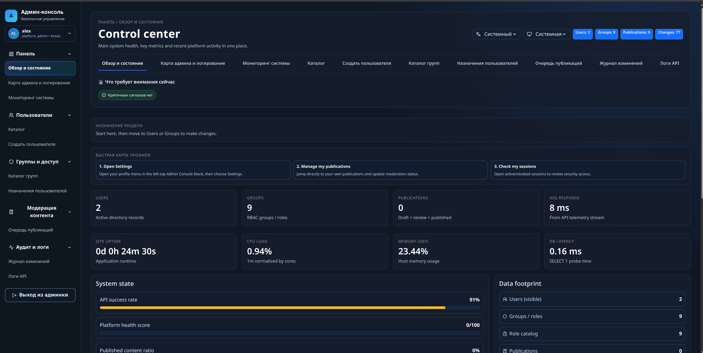
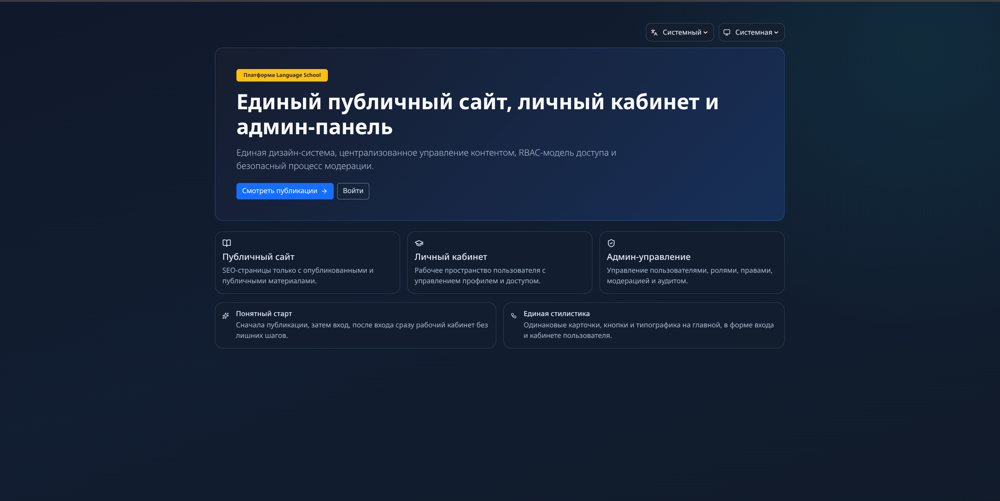

# Language School Platform

A full-stack learning platform with one consistent product flow:
public website -> login -> student workspace -> admin console.

This project exists to solve a common real problem:
- learners need a clean place to study and track progress,
- teams need safe content management and moderation,
- administrators need control, visibility, and audit-ready operations.

The platform keeps these parts in one system, with shared design and shared access rules.

## Why this project exists

Most small learning products split into disconnected tools.
That causes repeated work, unstable progress logic, and weak operational control.

This project is built to provide:
- one identity and access model for all areas,
- one backend source of truth for progress and permissions,
- one UI language across public, student, and admin screens,
- one deployable stack for development and production.

## Product areas

1. Public website
- clear product message,
- public content and entry points,
- direct path to sign in.

2. Login and account access
- focused authentication screen,
- secure session-based access,
- role-aware routing after sign in.

3. Student workspace
- dashboard with lessons, progress, and activity,
- personal settings and profile controls,
- simple flow to continue learning sessions.

4. Admin console
- user and group management,
- moderation and publication workflows,
- audit and system metrics in one place.

## Screenshots

### Student dashboard


### Admin console


### Public homepage


## Architecture summary

- `frontend-react/`: React + TypeScript user interface
- `backend/`: Node.js + TypeScript API and business logic
- `ai_bridge/`: task orchestration and worker runtime module
- `infra/`: observability and deployment support files
- `scripts/`: local and container automation scripts

## Core principles

- Backend owns business truth.
- Role-based access is enforced server-side.
- Progress is state-driven, not button-driven.
- Security and audit trails are part of normal operations.
- Design language stays consistent across all product areas.

## Getting started

1. Prepare environment
```bash
cp .env.example .env
```

2. Start infrastructure and services
```bash
bash scripts/start_replicated_db.sh
bash scripts/build_abstracted.sh
bash scripts/start_manual.sh
```

3. Open apps
- Web: `http://localhost:8081`
- API: `http://localhost:3001`

## Development commands

Frontend:
```bash
cd frontend-react
npm install
npm run dev
npm run build
```

Backend:
```bash
cd backend
npm install
npm run dev
npm run build
```

AI Orchestrator (Integrated API):
```bash
# Start the core and API bridge
bash ai_bridge/scripts/start_orchestrator.sh

# Run the interactive console (in another terminal)
python3 ai_bridge/scripts/chat_console.py
```

Tests:
```bash
npm test
python3 -m pytest ai_bridge/tests
```

## Documentation

See `docs/` for:
- architecture,
- API references,
- operations runbooks,
- migration and release policies,
- RBAC and security governance.

## License

MIT (see `LICENSE`).
