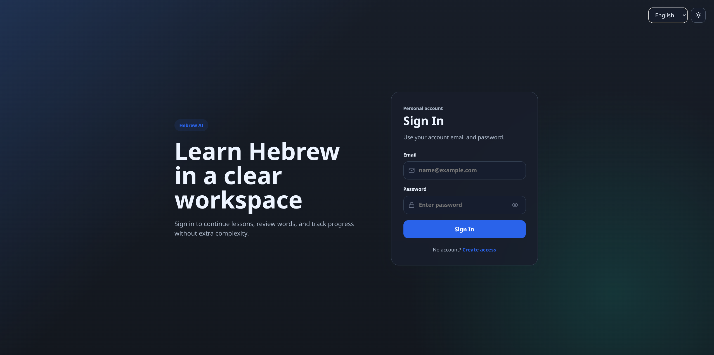

# Hebrew AI Platform

A learning workspace for the Hebrew language, integrated with a multi-agent AI orchestration layer.



## Architecture Overview

The platform consists of four primary components designed for performance, security, and scalability:

### 1. AI Bridge Orchestration
A Python-based multi-agent runtime that manages task decomposition and execution across multiple LLM providers.
- **Capability Routing**: Directs tasks to specialized agents (Codex, Reviewer, Tester, Planner).
- **Quality Gates**: Iterative feedback loops to ensure result accuracy.
- **Smart Scheduling**: Priority-aware load balancing based on agent health, latency, and success rates.

### 2. Data Layer
- **Replicated PostgreSQL**: Master-Replica setup to ensure data durability and separate write operations from high-volume reads.
- **Full-Text Search**: Optimized Hebrew search using PostgreSQL GIN indexes and `tsvector`.
- **Performance Caching**: Redis-backed session management.

### 3. Secure Isolation (BridgeOS)
Designed for execution within isolated development environments (Flatpak/Containers).
- **Host Bridge**: A secure gateway for interacting with host-level utilities like Docker and Podman.
- **Command Whitelisting**: Strict audit trails and security policies governing host-to-container communication.

### 4. Frontend
- **React + TypeScript**: Type-safe, component-driven UI.
- **Tailwind CSS**: A dark-themed, minimal interface focused on distraction-free learning.
- **Vite**: Fast development and build toolchain.

---

## Project Structure

```text
├── ai_bridge/          # Python AI Orchestration Layer
│   ├── core/           # Routing, Load Balancing, Security
│   └── agents/         # LLM Provider Abstractions
├── backend/            # TypeScript / Node.js API
│   ├── database/       # Migrations & Master-Replica logic
│   └── api/            # Security Middleware & Controllers
├── frontend-react/     # Vite / React / Tailwind Frontend
├── scripts/            # Infrastructure & BridgeOS scripts
└── infra/              # Observability (Grafana, Loki)
```

---

## Getting Started

### 1. Initialize Secure Bridge
Grant the isolated environment access to required host utilities:
```bash
bash scripts/bridge/auto_bridge.sh
```

### 2. Setup Data Infrastructure
Provision the replicated database and Redis:
```bash
bash scripts/start_replicated_db.sh
```

### 3. Build & Launch
Build the container images and start the services:
```bash
bash scripts/build_abstracted.sh
bash scripts/start_manual.sh
```

- **Web Interface**: `http://localhost:8081`
- **Backend API**: `http://localhost:3001`

---

## Testing

### AI Bridge Tests
```bash
python3 -m pytest ai_bridge/tests
```

### Full System Tests
```bash
npm test
```

## Security
All communication with the host machine is audited. Direct execution is disabled. To allow new host commands, update `scripts/bridge/whitelist.txt`.
